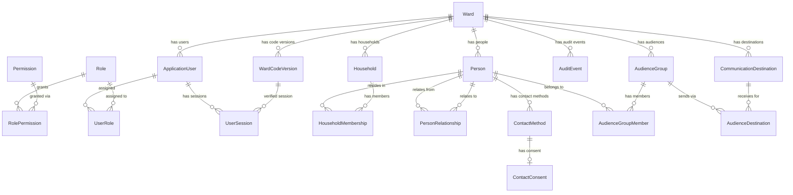

# Domain Model — Phase 3

This document describes the core entity relationship model implemented in
`packages/database/prisma/schema.prisma`, the rationale for its constraints,
and the pure business rules implemented alongside it in `packages/domain`.

## Entity relationship diagram

## Design decisions and constraints

### Tenancy

Every directory, audience, and communication record is scoped to a `Ward`
via a `wardId` foreign key. Wards are soft-archived (`archivedAt`), never
physically deleted, because historical audit and delivery data must survive
(AGENTS.md #12).

### Authorization (schema only in Phase 3)

`Role`, `Permission`, and the `RolePermission` join table implement a
standard RBAC shape. `UserRole` assigns roles to `ApplicationUser`. These
tables exist in Phase 3 and are seeded (`prisma/seed.ts`) but the
authorization *behavior* (checking permissions on protected routes) is
implemented in Phase 4.

### Users, sessions, and the ward code

- `ApplicationUser.passwordHash` stores only an Argon2id hash — never a
  readable password (AGENTS.md #1, security.mdc).
- `failedLoginAttempts` / `lastFailedLoginAt` / `lockedUntil` support
  rate limiting and lockout without ever recording the attempted password
  itself (security.mdc: "record failed login attempts without storing
  attempted passwords").
- `WardCodeVersion.codeHash` stores only a hash of the shared ward code
  combined with a server-side pepper. Multiple versions exist to support
  rotation; exactly one version per ward should have `retiredAt = null`
  (the active version). That invariant is enforced by the Phase 4
  application service, not a schema constraint, since Prisma/Postgres
  cannot easily express "at most one row per group matching a predicate"
  declaratively.
- `UserSession.deviceId` and `wardCodeVersionId` together implement "ward
  code required again on a new device or after rotation": a session
  created against ward code version N is only valid evidence of ward-code
  possession for version N.
- Only *hashes* of session/refresh tokens are stored, so a database leak
  cannot be used to replay sessions.

### Directory: people, households, relationships, contact, consent

- **Household membership vs. person relationship are intentionally
  separate models.** `HouseholdMembership` captures *where someone lives*
  and their administrative `householdRole` (Head/Member). `PersonRelationship`
  captures *family relationship* (Husband/Wife/Parent/Child/Guardian/etc.)
  between two people, independent of whether they share an address. This
  lets us represent a non-resident parent, a guardian who lives elsewhere,
  or two households sharing custody of a dependent.
- `PersonRelationship` is **directed** (`personId` → `relatedPersonId`) with
  a `relationshipType` describing the direction from `personId`'s
  perspective. The domain package's `buildRelationshipPair` helper computes
  the reciprocal row (e.g. Husband ↔ Wife) so the application layer creates
  both directions consistently in one transaction. Divorce/remarriage are
  representable because relationships are archived (`archivedAt`), not
  deleted, and the uniqueness constraint is scoped to
  `(personId, relatedPersonId, relationshipType)` rather than one spouse
  slot per person — a new `Spouse`/`Husband`/`Wife` row to a *different*
  related person can always be added.
- The application layer must reject `personId === relatedPersonId`
  (`assertNotSelfRelationship`); Postgres/Prisma in this version has no
  portable way to express that as a declarative CHECK constraint on this
  schema.
- `ContactMethod.normalizedValue` (lowercased email / E.164-ish phone) is
  computed once via `packages/domain`'s `normalizeEmail` /
  `normalizePhone` and used for search and duplicate detection, while
  `value` retains exactly what was entered.
- `ContactConsent` is **one row per contact method**, defaulting to
  `Unknown`. Consent is never inferred from audience membership or any
  other record (AGENTS.md #8) — only an explicit `Granted` status
  (`isConsentedToSend`) permits sending to that contact method.
- Minor status is derived, not stored: `packages/domain`'s `isMinor` /
  `calculateAgeYears` compute it from `Person.dateOfBirth`. Unknown date of
  birth is treated as "assume minor" (fail closed) so restricted UI/API
  paths never accidentally expose contact details for someone whose age is
  unknown. Phase 5 wires this into permission checks
  (`minors.contact.read`).

### Audiences and communication destinations

- `AudienceGroup` ↔ `Person` is many-to-many via `AudienceGroupMember`.
  Group names are never hardcoded into business logic — see the comment in
  `prisma/seed.ts`; any example names shipped there are illustrative seed
  data only, not domain constants (AGENTS.md #10 / phases/06-audiences.md).
- `AudienceGroup` ↔ `CommunicationDestination` is many-to-many via
  `AudienceDestination`, so a single audience can fan out to multiple
  channels/destinations, and a destination can serve multiple audiences.
- `CommunicationDestination` stores only a non-secret
  `providerAccountReference` and non-secret `configuration` JSON. Real
  provider credentials belong in a managed secret store (Phase 9), never in
  this table or source control (security.mdc, AGENTS.md #3).

### Audit

`AuditEvent` is an append-only log. `entityId` is a plain string (not a
foreign key) and `actorUserId` uses `onDelete: SetNull` so an audit row
always survives even if the entity or actor it references is later removed
under a data-retention policy (AGENTS.md #12/#15). `metadata` must never
contain secrets or more personal data than the action requires
(security.mdc: "redact personal data from logs").

## Indexing and duplication guards

- Common search/join paths are indexed: `Person(wardId, lastName, firstName)`,
  `Person(wardId, archivedAt)`, `ContactMethod(normalizedValue)`,
  `AuditEvent(wardId, createdAt)`, `AuditEvent(entityType, entityId)`, etc.
- Unique constraints prevent accidental duplication:
  `ApplicationUser(wardId, username)` / `(wardId, email)`,
  `HouseholdMembership(personId, householdId)`,
  `PersonRelationship(personId, relatedPersonId, relationshipType)`,
  `ContactMethod(personId, type, value)`,
  `AudienceGroupMember(audienceGroupId, personId)`,
  `AudienceDestination(audienceGroupId, destinationId)`,
  `AudienceGroup(wardId, name)`, `CommunicationDestination(wardId, name)`,
  `WardCodeVersion(wardId, version)`.

## Seed data

`packages/database/prisma/seed.ts` seeds only `Role` and `Permission` rows
(and their `RolePermission` links), per phases/03-domain-model.md. No
people, households, wards, or audience data is seeded — fictional test
fixtures live in `packages/testing` instead (AGENTS.md #5).

## Where domain rules live

Pure, framework-independent rules derived from this schema live in
`packages/domain`:

| Rule | File |
| --- | --- |
| Minor status / age calculation | `age.ts` |
| Self-relationship rejection, reciprocal relationship pairing | `relationship-rules.ts` |
| Consent-to-send check (never inferred) | `consent-rules.ts` |
| Email/phone normalization | `contact-normalization.ts` |
| Shared enums (mirrors Prisma enums without importing Prisma) | `enums.ts` |

These are unit tested in `packages/domain/src/*.test.ts` with fictional
data only, independent of a running database.

## Migration and integration testing

The Phase 3 migration (`prisma/migrations/20260726085001_init_domain_model`)
creates every table/enum/index/constraint described above. It is verified with:

- `pnpm --filter @ward-comms/database exec prisma validate` — schema is
  syntactically and referentially valid.
- `pnpm --filter @ward-comms/database exec prisma generate` — the Prisma
  Client generates successfully from the schema.
- `packages/database/src/schema.integration.test.ts` — exercises the
  constraints described above (unique constraints, cascade behavior,
  consent defaulting, audit survival) against a real PostgreSQL instance:
  `docker compose up -d postgres && pnpm --filter @ward-comms/database
  db:migrate && pnpm --filter @ward-comms/database test`. This test probes
  the database first and skips itself (rather than failing) when no
  migrated PostgreSQL instance is reachable, so `pnpm test` remains green
  in sandboxed environments without Docker while still providing real
  coverage wherever a database is available.
